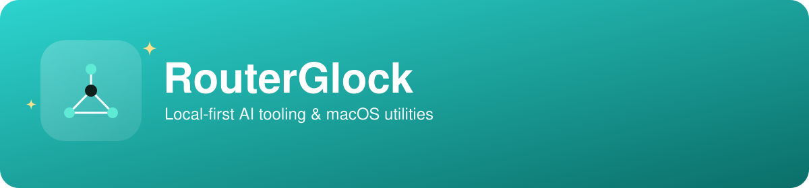

Self-taught software builder shipping **local-first developer tools** — LM
Studio plugins, an MCP server, and on-device macOS utilities. I build things
that run entirely on the user's own machine, document them so someone else
can actually run them, and ship rather than prototype.

Full background, résumé, and a live demo → **[my portfolio](https://claude.ai/code/artifact/c79a4d8b-29a2-4018-8329-0aa4d05c475e)**

## What I build

| Repo | What it does |
|---|---|
| 🖼️ [`qwen-comfyui-image-gen`](https://github.com/RouterGlock/qwen-comfyui-image-gen) | LM Studio plugin — a local LLM writes the prompt and calls ComfyUI directly to generate, edit, and reference-guide images |
| 🎬 [`minimax-h3-comfyui-video`](https://github.com/RouterGlock/minimax-h3-comfyui-video) | Same idea for video — ComfyUI + MiniMax H3 generate short clips with native audio, straight into the chat |
| 🧹 [`MacClean`](https://github.com/RouterGlock/MacClean) | On-device antivirus + junk/cleanup toolkit for macOS — ClamAV and a CleanMyMac-style cleaner in one CLI, plus a menu app |
| 📁 [`projectfs`](https://github.com/RouterGlock/projectfs) | Per-project folder scoping for Claude Desktop — one MCP server, no dependencies |
| 🔳 [`Reticle`](https://github.com/RouterGlock/Reticle) | Reads the codes your phone can't — QR, Aztec, Data Matrix, PDF417 and 1-D barcodes, CLI + client-side web scanner |
| 🧰 [`lmstudio-local-tools`](https://github.com/RouterGlock/lmstudio-local-tools) | Offline terminal, browser, and web-search tools for any local LM Studio model |

## Stack

## Background

Four years as a U.S. Marine, five as a certified Law Enforcement and
Corrections Officer, now building software full-time — self-taught,
shipping in public. More on that path, and everything above in context, is
on [my portfolio](https://claude.ai/code/artifact/c79a4d8b-29a2-4018-8329-0aa4d05c475e).
